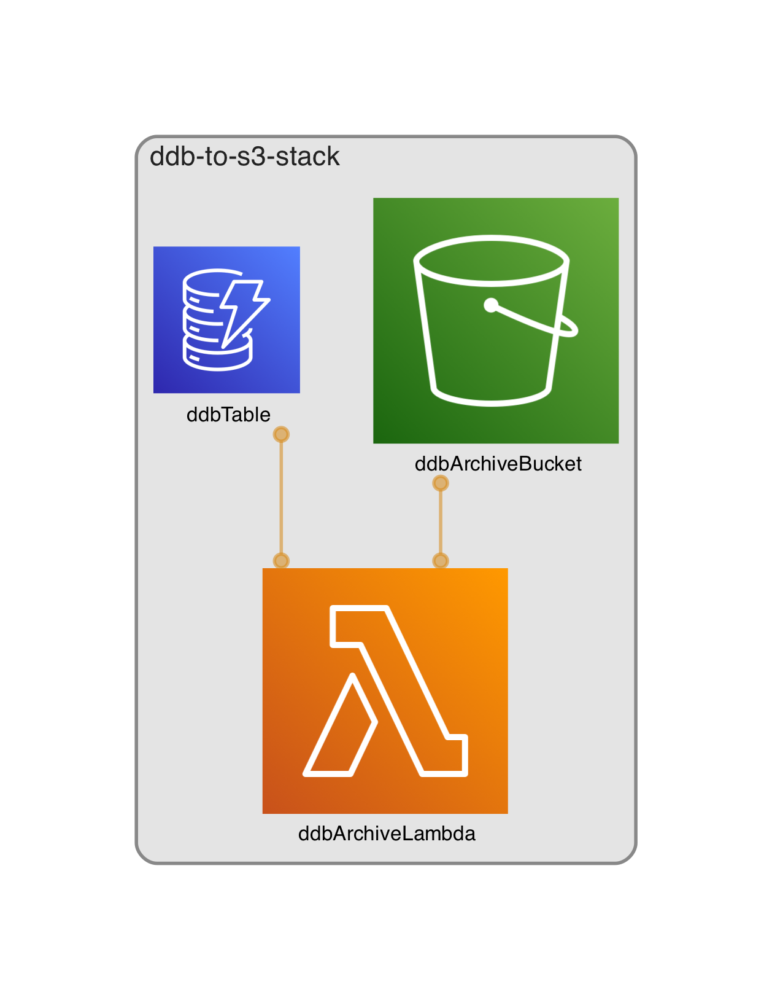

# cdk-ddb-to-s3

Repo for blog post https://martinmueller.dev/dynamodb-to-s3-eng/

## architecture

Curious how I did the diagram? Have a look here https://martinmueller.dev/cdk-dia-eng .

## Thanks To

- As always to the amazing CDK / Projen Community. Join us on [Slack](https://cdk-dev.slack.com)!
- [Projen](https://github.com/projen/projen) project and the community around it

I love to work on Content Management Open Source projects. A lot from my stuff you can already use on https://github.com/mmuller88 . If you like my work there and my blog posts, please consider supporting me on Patreon:

Or:

